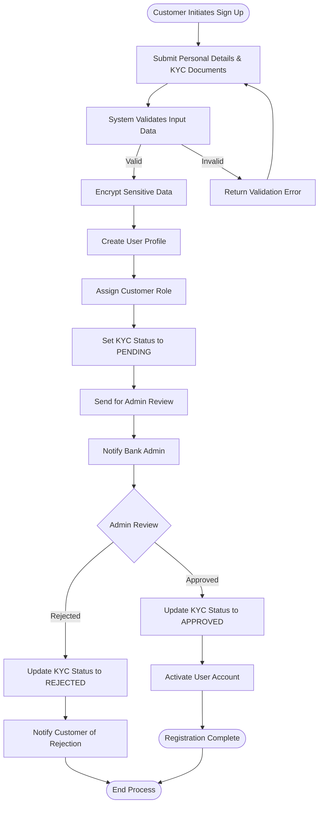
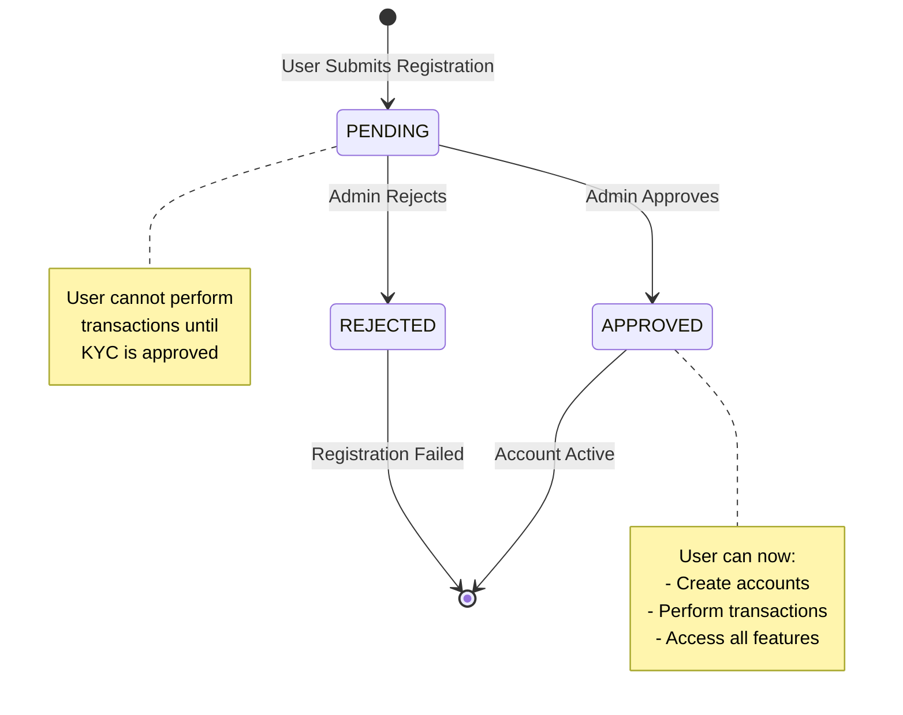
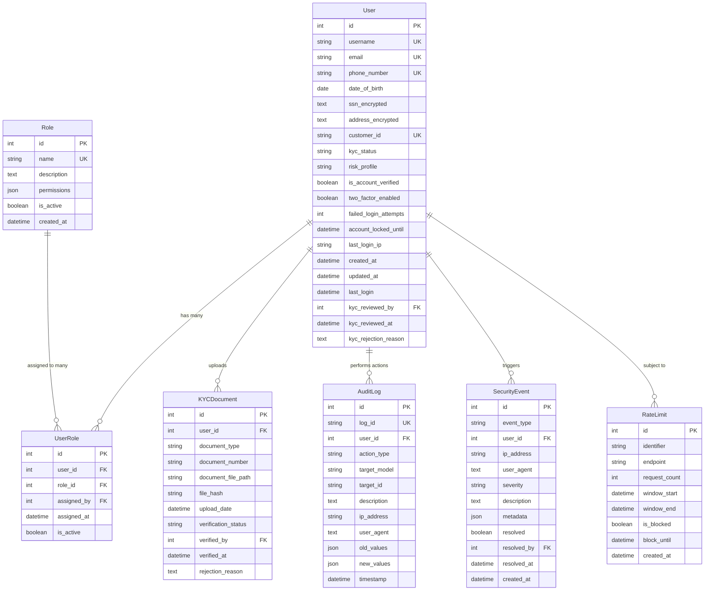
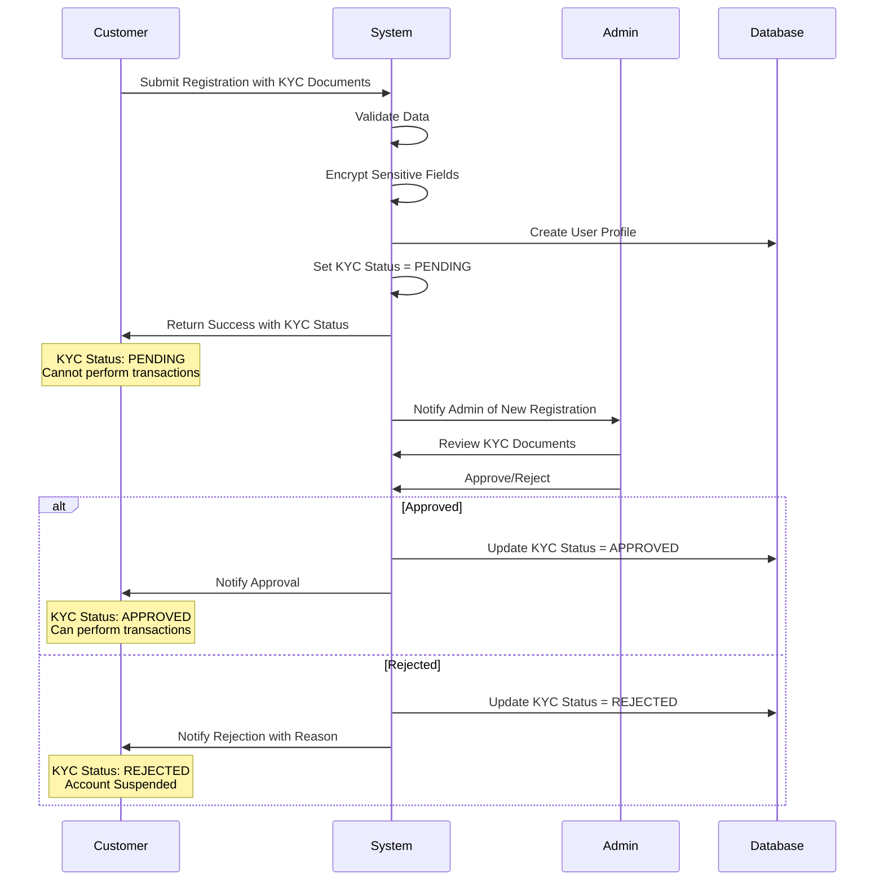

# Core Banking System - User Registration & KYC

A comprehensive banking application built with Django REST Framework implementing secure user registration, KYC verification, and role-based access control.

## 🎯 Overview

This system provides a secure, scalable banking solution with three primary actor roles:

### Actors/Roles

1. **Customer** - Registers accounts, performs transactions, views statements
2. **Bank Admin** - Approves loans, manages customer accounts, reviews flagged transactions
3. **Auditor** - Accesses audit logs, reviews system activity

## 🔄 Use Case 1: User Registration and KYC

### Trigger
Customer signs up for a banking account

### Flow Diagram



### Detailed Flow Steps

1. **Customer Submits Registration Form**
   - Personal Information (Name, DOB, Phone, Email)
   - KYC Documents (Simulated Upload)
   - Password & Security Details
   - Address & SSN (Encrypted)

2. **System Validation**
   - Validate email format and uniqueness
   - Validate phone number format
   - Check password strength
   - Verify age requirement (18+)
   - Validate SSN format
   - Check for duplicate accounts

3. **Data Encryption**
   - Encrypt SSN using Fernet encryption
   - Encrypt address information
   - Store sensitive data securely

4. **User Profile Creation**
   - Generate unique Customer ID
   - Assign default Customer role
   - Set KYC status to PENDING
   - Set risk profile to LOW
   - Create encrypted profile

5. **Admin Review Process**
   - Bank admin receives notification
   - Review submitted documents (simulated)
   - Verify customer identity
   - Approve or reject application

6. **Account Activation**
   - On approval: Set KYC status to APPROVED
   - Activate user account
   - Enable full banking features
   - On rejection: Notify customer with reason

### KYC Status Flow



## 📡 API Documentation

### Authentication Endpoints

#### 1. User Registration
**Endpoint:** `POST /api/auth/register/`

**Description:** Register a new customer with KYC verification

**Request Body:**
```json
{
  "username": "john_doe",
  "email": "john.doe@example.com",
  "password": "SecurePass123!",
  "confirm_password": "SecurePass123!",
  "first_name": "John",
  "last_name": "Doe",
  "phone_number": "+1234567890",
  "date_of_birth": "1990-01-15",
  "ssn": "123-45-6789",
  "address": "123 Main St, City, State, ZIP"
}
```

**Success Response (201 Created):**
```json
{
  "id": 1,
  "username": "john_doe",
  "email": "john.doe@example.com",
  "first_name": "John",
  "last_name": "Doe",
  "customer_id": "CUST1234567890",
  "kyc_status": "PENDING",
  "risk_profile": "LOW",
  "is_account_verified": false
}
```

**Error Response (400 Bad Request):**
```json
{
  "username": ["A user with that username already exists."],
  "email": ["Enter a valid email address."],
  "confirm_password": ["Password fields didn't match."]
}
```

**Validation Rules:**
- Username: Unique, alphanumeric
- Email: Valid format, unique
- Password: Minimum 8 characters, contains uppercase, lowercase, numbers
- Phone: Format: `+999999999`
- Date of Birth: Must be 18+ years old
- SSN: Will be encrypted before storage

#### 2. User Login
**Endpoint:** `POST /api/auth/login/`

**Description:** Authenticate user and receive JWT tokens

**Request Body:**
```json
{
  "username": "john_doe",
  "password": "SecurePass123!"
}
```

**Success Response (200 OK):**
```json
{
  "access": "eyJ0eXAiOiJKV1QiLCJhbGciOiJIUzI1NiJ9...",
  "refresh": "eyJ0eXAiOiJKV1QiLCJhbGciOiJIUzI1NiJ9...",
  "user": {
    "id": 1,
    "username": "john_doe",
    "email": "john.doe@example.com",
    "customer_id": "CUST1234567890",
    "kyc_status": "APPROVED",
    "risk_profile": "LOW"
  }
}
```

**Security Features:**
- Account locks after 5 failed attempts
- Lock duration: 30 minutes
- Rate limiting: 5 attempts per minute per IP

### User Profile Endpoints

#### 3. Get User Profile
**Endpoint:** `GET /api/profile/`

**Description:** Retrieve current user profile

**Headers:**
```
Authorization: Bearer <access_token>
```

**Success Response (200 OK):**
```json
{
  "id": 1,
  "username": "john_doe",
  "email": "john.doe@example.com",
  "first_name": "John",
  "last_name": "Doe",
  "phone_number": "+1234567890",
  "customer_id": "CUST1234567890",
  "kyc_status": "APPROVED",
  "risk_profile": "LOW",
  "is_account_verified": true,
  "two_factor_enabled": false,
  "roles": [
    {
      "id": 1,
      "name": "CUSTOMER",
      "description": "Bank Customer"
    }
  ],
  "date_joined": "2024-01-15T10:30:00Z",
  "last_login": "2024-01-15T12:45:00Z"
}
```

#### 4. Update User Profile
**Endpoint:** `PUT /api/profile/`

**Description:** Update user profile information

**Headers:**
```
Authorization: Bearer <access_token>
```

**Request Body:**
```json
{
  "first_name": "John",
  "last_name": "Doe Updated",
  "phone_number": "+1234567890"
}
```

**Note:** Sensitive fields (SSN, address) cannot be updated via API for security reasons.

### KYC Document Endpoints

#### 5. Upload KYC Document
**Endpoint:** `POST /api/kyc/upload/`

**Description:** Upload KYC verification documents

**Headers:**
```
Authorization: Bearer <access_token>
Content-Type: multipart/form-data
```

**Request Body (Form Data):**
```
document_type: GOVERNMENT_ID
document_number: ABC123456789
document_file: [file upload]
```

**Supported Document Types:**
- `GOVERNMENT_ID` - Government issued ID
- `PASSPORT` - Passport
- `DRIVER_LICENSE` - Driver's License
- `UTILITY_BILL` - Utility Bill
- `BANK_STATEMENT` - Bank Statement
- `OTHER` - Other documents

**Success Response (201 Created):**
```json
{
  "id": 1,
  "document_type": "GOVERNMENT_ID",
  "document_number": "ABC123456789",
  "upload_date": "2024-01-15T10:30:00Z",
  "verification_status": "PENDING",
  "message": "Document uploaded successfully"
}
```

**Error Response (400 Bad Request):**
```json
{
  "document_type": ["You have already uploaded a Government Id document. Document ID: 1, Status: PENDING. Please select a different document type or contact support if you need to replace it."],
  "document_number": ["Document number 'ABC123456789' has already been used by another user. Please verify your document number or contact support if you believe this is an error."]
}
```

**Validation Rules:**
- File size: Maximum 10MB
- File types: PDF, JPG, JPEG, PNG
- Document number: Must be unique across all users
- Document type: Cannot upload same type twice per user
- User KYC status: Must be INCOMPLETE, PENDING, or REJECTED

#### 6. List KYC Documents
**Endpoint:** `GET /api/kyc/documents/`

**Description:** List user's uploaded KYC documents

**Headers:**
```
Authorization: Bearer <access_token>
```

**Success Response (200 OK):**
```json
{
  "count": 2,
  "results": [
    {
      "id": 1,
      "document_type": "GOVERNMENT_ID",
      "document_number": "ABC123456789",
      "upload_date": "2024-01-15T10:30:00Z",
      "verification_status": "PENDING"
    },
    {
      "id": 2,
      "document_type": "UTILITY_BILL",
      "document_number": "UTIL987654321",
      "upload_date": "2024-01-15T11:00:00Z",
      "verification_status": "VERIFIED"
    }
  ]
}
```

### Admin Endpoints (Bank Admin Only)

#### 7. Update KYC Status
**Endpoint:** `PUT /api/users/{user_id}/` (Admin Only)

**Description:** Update user's KYC status

**Request Body:**
```json
{
  "kyc_status": "APPROVED"
}
```

**Valid KYC Status Values:**
- `PENDING` - Awaiting review
- `APPROVED` - Verified and approved
- `REJECTED` - Rejected with reason

#### 8. List Fraud Alerts
**Endpoint:** `GET /api/fraud-alerts/`

**Description:** View fraud alerts (Bank Staff Only)

**Headers:**
```
Authorization: Bearer <admin_access_token>
```

**Success Response (200 OK):**
```json
{
  "count": 3,
  "results": [
    {
      "alert_id": "ALERT123ABC",
      "alert_type": "SUSPICIOUS_TRANSACTION",
      "severity": "HIGH",
      "status": "OPEN",
      "title": "Large Unusual Transaction",
      "description": "Transaction amount exceeds normal pattern",
      "risk_score": 75,
      "created_at": "2024-01-15T10:00:00Z"
    }
  ]
}
```

### Audit Log Endpoints (Auditor Access)

#### 9. View Audit Logs
**Endpoint:** `GET /api/audit-logs/`

**Description:** Access audit trail (Auditor & Admin Only)

**Success Response (200 OK):**
```json
{
  "count": 100,
  "results": [
    {
      "log_id": "LOG123ABC",
      "action_type": "CREATE",
      "user": {
        "username": "john_doe",
        "customer_id": "CUST1234567890"
      },
      "target_model": "Transaction",
      "description": "Transaction created",
      "ip_address": "192.168.1.1",
      "timestamp": "2024-01-15T12:00:00Z"
    }
  ]
}
```

## 🗄️ Database Schema

### Core Models for User Registration & KYC

#### **1. User Model**
```python
class User(AbstractUser):
    # Basic Information
    email = models.EmailField(unique=True)
    phone_number = models.CharField(max_length=15, unique=True)
    date_of_birth = models.DateField()
    
    # Encrypted Sensitive Data
    ssn_encrypted = models.TextField()  # Fernet encrypted SSN
    address_encrypted = models.TextField()  # Fernet encrypted address
    
    # Banking Information
    customer_id = models.CharField(max_length=20, unique=True)
    kyc_status = models.CharField(
        max_length=20,
        choices=[
            ('PENDING', 'Pending Review'),
            ('APPROVED', 'Approved'),
            ('REJECTED', 'Rejected'),
            ('EXPIRED', 'Expired')
        ],
        default='PENDING'
    )
    risk_profile = models.CharField(
        max_length=10,
        choices=[
            ('LOW', 'Low Risk'),
            ('MEDIUM', 'Medium Risk'),
            ('HIGH', 'High Risk')
        ],
        default='LOW'
    )
    
    # Security Fields
    is_account_verified = models.BooleanField(default=False)
    two_factor_enabled = models.BooleanField(default=False)
    failed_login_attempts = models.IntegerField(default=0)
    account_locked_until = models.DateTimeField(null=True, blank=True)
    last_login_ip = models.GenericIPAddressField(null=True, blank=True)
    
    # Timestamps
    created_at = models.DateTimeField(auto_now_add=True)
    updated_at = models.DateTimeField(auto_now=True)
    last_login = models.DateTimeField(null=True, blank=True)
    
    # KYC Review Fields
    kyc_reviewed_by = models.ForeignKey(
        'self', 
        on_delete=models.SET_NULL, 
        null=True, 
        blank=True,
        related_name='kyc_reviews'
    )
    kyc_reviewed_at = models.DateTimeField(null=True, blank=True)
    kyc_rejection_reason = models.TextField(null=True, blank=True)
```

#### **2. Role Model**
```python
class Role(models.Model):
    name = models.CharField(max_length=50, unique=True)
    description = models.TextField()
    permissions = models.JSONField(default=list)  # List of permission strings
    is_active = models.BooleanField(default=True)
    created_at = models.DateTimeField(auto_now_add=True)
    
    class Meta:
        db_table = 'auth_role'
    
    def __str__(self):
        return self.name
```

#### **3. UserRole Model (Many-to-Many)**
```python
class UserRole(models.Model):
    user = models.ForeignKey(User, on_delete=models.CASCADE)
    role = models.ForeignKey(Role, on_delete=models.CASCADE)
    assigned_by = models.ForeignKey(
        User, 
        on_delete=models.SET_NULL, 
        null=True,
        related_name='role_assignments'
    )
    assigned_at = models.DateTimeField(auto_now_add=True)
    is_active = models.BooleanField(default=True)
    
    class Meta:
        db_table = 'auth_user_role'
        unique_together = ['user', 'role']
```

#### **4. KYC Document Model**
```python
class KYCDocument(models.Model):
    user = models.ForeignKey(User, on_delete=models.CASCADE)
    document_type = models.CharField(
        max_length=50,
        choices=[
            ('GOVERNMENT_ID', 'Government ID'),
            ('PASSPORT', 'Passport'),
            ('DRIVER_LICENSE', 'Driver License'),
            ('UTILITY_BILL', 'Utility Bill'),
            ('BANK_STATEMENT', 'Bank Statement'),
            ('OTHER', 'Other')
        ]
    )
    document_number = models.CharField(max_length=100)
    document_file_path = models.CharField(max_length=500)  # Encrypted file path
    file_hash = models.CharField(max_length=64)  # SHA-256 hash for integrity
    upload_date = models.DateTimeField(auto_now_add=True)
    verification_status = models.CharField(
        max_length=20,
        choices=[
            ('PENDING', 'Pending'),
            ('VERIFIED', 'Verified'),
            ('REJECTED', 'Rejected')
        ],
        default='PENDING'
    )
    verified_by = models.ForeignKey(
        User, 
        on_delete=models.SET_NULL, 
        null=True,
        related_name='verified_documents'
    )
    verified_at = models.DateTimeField(null=True, blank=True)
    rejection_reason = models.TextField(null=True, blank=True)
    
    class Meta:
        db_table = 'kyc_document'
```

#### **5. Audit Log Model**
```python
class AuditLog(models.Model):
    log_id = models.CharField(max_length=50, unique=True)
    user = models.ForeignKey(
        User, 
        on_delete=models.SET_NULL, 
        null=True,
        related_name='audit_logs'
    )
    action_type = models.CharField(
        max_length=20,
        choices=[
            ('CREATE', 'Create'),
            ('UPDATE', 'Update'),
            ('DELETE', 'Delete'),
            ('LOGIN', 'Login'),
            ('LOGOUT', 'Logout'),
            ('KYC_APPROVE', 'KYC Approve'),
            ('KYC_REJECT', 'KYC Reject'),
            ('PASSWORD_CHANGE', 'Password Change'),
            ('ROLE_ASSIGN', 'Role Assign')
        ]
    )
    target_model = models.CharField(max_length=50)  # Model name
    target_id = models.CharField(max_length=50, null=True, blank=True)
    description = models.TextField()
    ip_address = models.GenericIPAddressField()
    user_agent = models.TextField(null=True, blank=True)
    old_values = models.JSONField(null=True, blank=True)
    new_values = models.JSONField(null=True, blank=True)
    timestamp = models.DateTimeField(auto_now_add=True)
    
    class Meta:
        db_table = 'audit_log'
        ordering = ['-timestamp']
```

#### **6. Rate Limit Model**
```python
class RateLimit(models.Model):
    identifier = models.CharField(max_length=100)  # IP or User ID
    endpoint = models.CharField(max_length=200)
    request_count = models.IntegerField(default=1)
    window_start = models.DateTimeField()
    window_end = models.DateTimeField()
    is_blocked = models.BooleanField(default=False)
    block_until = models.DateTimeField(null=True, blank=True)
    created_at = models.DateTimeField(auto_now_add=True)
    
    class Meta:
        db_table = 'rate_limit'
        unique_together = ['identifier', 'endpoint', 'window_start']
```

#### **7. Security Event Model**
```python
class SecurityEvent(models.Model):
    event_type = models.CharField(
        max_length=50,
        choices=[
            ('FAILED_LOGIN', 'Failed Login'),
            ('ACCOUNT_LOCKED', 'Account Locked'),
            ('SUSPICIOUS_ACTIVITY', 'Suspicious Activity'),
            ('RATE_LIMIT_EXCEEDED', 'Rate Limit Exceeded'),
            ('UNAUTHORIZED_ACCESS', 'Unauthorized Access'),
            ('PASSWORD_RESET', 'Password Reset'),
            ('2FA_ENABLED', '2FA Enabled'),
            ('2FA_DISABLED', '2FA Disabled')
        ]
    )
    user = models.ForeignKey(
        User, 
        on_delete=models.SET_NULL, 
        null=True,
        related_name='security_events'
    )
    ip_address = models.GenericIPAddressField()
    user_agent = models.TextField(null=True, blank=True)
    severity = models.CharField(
        max_length=10,
        choices=[
            ('LOW', 'Low'),
            ('MEDIUM', 'Medium'),
            ('HIGH', 'High'),
            ('CRITICAL', 'Critical')
        ],
        default='MEDIUM'
    )
    description = models.TextField()
    metadata = models.JSONField(null=True, blank=True)
    resolved = models.BooleanField(default=False)
    resolved_by = models.ForeignKey(
        User, 
        on_delete=models.SET_NULL, 
        null=True,
        related_name='resolved_events'
    )
    resolved_at = models.DateTimeField(null=True, blank=True)
    created_at = models.DateTimeField(auto_now_add=True)
    
    class Meta:
        db_table = 'security_event'
        ordering = ['-created_at']
```

### **Database Relationships**



### **Database Indexes for Performance**

```sql
-- User table indexes
CREATE INDEX idx_user_email ON auth_user(email);
CREATE INDEX idx_user_phone ON auth_user(phone_number);
CREATE INDEX idx_user_customer_id ON auth_user(customer_id);
CREATE INDEX idx_user_kyc_status ON auth_user(kyc_status);
CREATE INDEX idx_user_created_at ON auth_user(created_at);

-- Audit log indexes
CREATE INDEX idx_audit_log_user_id ON audit_log(user_id);
CREATE INDEX idx_audit_log_timestamp ON audit_log(timestamp);
CREATE INDEX idx_audit_log_action_type ON audit_log(action_type);
CREATE INDEX idx_audit_log_ip_address ON audit_log(ip_address);

-- Rate limit indexes
CREATE INDEX idx_rate_limit_identifier ON rate_limit(identifier);
CREATE INDEX idx_rate_limit_endpoint ON rate_limit(endpoint);
CREATE INDEX idx_rate_limit_window ON rate_limit(window_start, window_end);

-- Security event indexes
CREATE INDEX idx_security_event_user_id ON security_event(user_id);
CREATE INDEX idx_security_event_type ON security_event(event_type);
CREATE INDEX idx_security_event_severity ON security_event(severity);
CREATE INDEX idx_security_event_created_at ON security_event(created_at);

-- KYC document indexes
CREATE INDEX idx_kyc_document_user_id ON kyc_document(user_id);
CREATE INDEX idx_kyc_document_status ON kyc_document(verification_status);
CREATE INDEX idx_kyc_document_type ON kyc_document(document_type);
```

### **Data Encryption Strategy**

#### **Encryption Keys Management**
```python
# Environment variables for encryption keys
ENCRYPTION_KEY_SSN = os.getenv('ENCRYPTION_KEY_SSN')
ENCRYPTION_KEY_ADDRESS = os.getenv('ENCRYPTION_KEY_ADDRESS')
ENCRYPTION_KEY_DOCUMENTS = os.getenv('ENCRYPTION_KEY_DOCUMENTS')

# Key rotation strategy
# - Generate new keys periodically
# - Store multiple key versions
# - Gradual migration of encrypted data
```

#### **Field-Level Encryption**
```python
# SSN Encryption
def encrypt_ssn(ssn_plain):
    f = Fernet(ENCRYPTION_KEY_SSN)
    return f.encrypt(ssn_plain.encode()).decode()

def decrypt_ssn(ssn_encrypted):
    f = Fernet(ENCRYPTION_KEY_SSN)
    return f.decrypt(ssn_encrypted.encode()).decode()

# Address Encryption
def encrypt_address(address_plain):
    f = Fernet(ENCRYPTION_KEY_ADDRESS)
    return f.encrypt(address_plain.encode()).decode()

def decrypt_address(address_encrypted):
    f = Fernet(ENCRYPTION_KEY_ADDRESS)
    return f.decrypt(address_encrypted.encode()).decode()
```

## 🔐 Security Features

### Data Encryption
- **SSN Encryption**: Fernet symmetric encryption
- **Address Encryption**: End-to-end encryption
- **Password Hashing**: Django's PBKDF2 algorithm
- **Document Encryption**: File-level encryption for KYC documents

### Authentication & Authorization
- **JWT Tokens**: Access token (60 min) + Refresh token (7 days)
- **Role-Based Access Control**: Customer, Bank Admin, Auditor roles
- **Permission System**: Granular permissions per role

### Account Security
- **Failed Login Protection**: Account locks after 5 failed attempts
- **Account Lock Duration**: 30 minutes
- **IP Tracking**: Log all login IPs
- **Session Management**: Secure session handling

### Fraud Detection
- **Risk Scoring**: Dynamic risk assessment (0-100)
- **Suspicious Activity Detection**: Automated flagging
- **Transaction Limits**: Daily and per-transaction limits
- **Pattern Analysis**: Unusual behavior detection

## ⚠️ Edge Cases & Solutions

### Authentication Edge Cases
- **Token expires during upload** → Auto-refresh with refresh token and retry request
- **Multiple device login** → Invalidate old refresh tokens, allow single active session
- **Concurrent login attempts** → Redis lock prevents race conditions with 30-second timeout
- **Invalid refresh token** → Force re-authentication, clear all stored tokens

### Registration Edge Cases
- **Duplicate email/phone** → Return 409 conflict with specific field error message
- **Invalid SSN format** → Validate 9-digit format, reject common test patterns (000-00-0000)
- **Age exactly 18** → Handle leap year edge case, verify exact birth date calculation
- **Future birth date** → Reject with validation error, log suspicious activity
- **Pending registration exists** → Return "Registration in progress" message, don't create duplicate

### KYC Upload Edge Cases
- **Large file (>10MB)** → Reject with size limit error, suggest file compression
- **Malicious file upload** → Scan MIME type, validate extensions, reject executables
- **Concurrent document upload** → Database lock prevents duplicate document types
- **Network interruption** → Implement resumable uploads with chunk tracking
- **Invalid file format** → Validate against allowed types (PDF, JPG, PNG, DOC)
- **Corrupted encrypted data** → Log security event, request re-upload with error message

### Admin Review Edge Cases
- **Multiple admins review same KYC** → Database lock with select_for_update prevents race conditions
- **Admin account deleted during review** → Reassign pending reviews to available admin
- **KYC already processed** → Return "Already reviewed" error, show current status
- **Admin permission revoked** → Revoke access immediately, reassign pending reviews

### Rate Limiting Edge Cases
- **Rate limit bypass with multiple IPs** → Track user across IPs, flag suspicious activity
- **Rate limit reset while blocked** → Check block_until timestamp, clear if expired
- **Redis connection loss** → Fallback to database rate limiting, log degradation
- **Progressive penalty escalation** → Increase lockout duration with each violation (1min→5min→30min→24hr)

### Data Security Edge Cases
- **Encryption key rotation** → Gradual re-encryption with new key, maintain old key for decryption
- **Corrupted encrypted data** → Log security event, request data re-upload
- **Database connection loss** → Return "System unavailable" error, retry mechanism
- **Audit log tampering** → Calculate and store hash, verify integrity periodically

### System Failure Edge Cases
- **Database timeout** → Implement connection pooling, retry with exponential backoff
- **Redis failure** → Fallback to database operations, degrade gracefully
- **File storage failure** → Retry upload, notify user of temporary issue
- **Memory exhaustion** → Implement file streaming, limit concurrent uploads

### User Experience Edge Cases
- **Browser refresh during registration** → Store progress in session, redirect to appropriate step
- **Slow network during upload** → Show progress bar, implement timeout with retry option
- **Form data loss** → Auto-save draft data, restore on page reload
- **Session timeout** → Extend session for active uploads, warn before expiration

### Compliance Edge Cases
- **Data retention expiration** → Auto-delete expired rejected KYC documents after 7 years
- **Audit log storage full** → Archive old logs, maintain retention policy compliance
- **Regulatory requirement change** → Update validation rules, notify affected users
- **GDPR data deletion request** → Anonymize data, maintain audit trail for compliance

### Error Handling Strategy
- **Validation errors** → Return specific field errors with correction suggestions
- **Authentication errors** → Clear session data, redirect to login with error message
- **Permission errors** → Log unauthorized access attempt, return generic "Access denied"
- **System errors** → Log detailed error, return user-friendly "Please try again" message
- **Unexpected errors** → Log with stack trace, return generic error, alert administrators

## 🚀 Getting Started

### Prerequisites
- Python 3.9+
- PostgreSQL 12+
- Redis 6+

### Installation

1. **Clone the repository**
```bash
git clone <repository-url>
cd core_banking
```

2. **Create virtual environment**
```bash
python -m venv banking_env
source banking_env/bin/activate  # Windows: banking_env\Scripts\activate
```

3. **Install dependencies**
```bash
pip install -r requirements.txt
```

4. **Configure environment**
Create `.env` file:
```env

DEBUG=True
DB_NAME=banking_db
DB_USER=postgres
DB_PASSWORD=your-password
DB_HOST=localhost
DB_PORT=5432

```

5. **Run migrations**
```bash
python manage.py makemigrations
python manage.py migrate
```

6. **Create superuser**
```bash
python manage.py createsuperuser
```

7. **Run server**
```bash
python manage.py runserver
```

## 📊 Role-Based Access Matrix

| Feature | Customer | Bank Admin | Auditor |
|---------|----------|------------|---------|
| Register Account | ✅ | ✅ | ❌ |
| View Own Profile | ✅ | ✅ | ✅ (Audit Log) |
| Upload KYC Documents | ✅ | ❌ | ❌ |
| Approve KYC | ❌ | ✅ | ❌ |
| View All Users | ❌ | ✅ | ❌ |
| View Fraud Alerts | ❌ | ✅ | ✅ |
| Access Audit Logs | ❌ | ❌ | ✅ |
| Manage System | ❌ | ⚠️ (Limited) | ❌ |

## 🧪 Testing the API

### 1. Register a New User
```bash
curl -X POST http://localhost:8000/api/auth/register/ \
  -H "Content-Type: application/json" \
  -d '{
    "username": "jane_doe",
    "email": "jane@example.com",
    "password": "SecurePass123!",
    "confirm_password": "SecurePass123!",
    "first_name": "Jane",
    "last_name": "Doe",
    "phone_number": "+1234567890",
    "date_of_birth": "1992-05-20",
    "ssn": "987-65-4321",
    "address": "456 Oak Ave, City, ST 12345"
  }'
```

### 2. Login
```bash
curl -X POST http://localhost:8000/api/auth/login/ \
  -H "Content-Type: application/json" \
  -d '{
    "username": "jane_doe",
    "password": "SecurePass123!"
  }'
```

Save the `access` token from the response.

### 3. View Profile
```bash
curl -X GET http://localhost:8000/api/profile/ \
  -H "Authorization: Bearer YOUR_ACCESS_TOKEN"
```

### 4. Upload KYC Document
```bash
curl -X POST http://localhost:8000/api/kyc/upload/ \
  -H "Authorization: Bearer YOUR_ACCESS_TOKEN" \
  -F "document_type=GOVERNMENT_ID" \
  -F "document_number=ABC123456" \
  -F "document_file=@/path/to/document.pdf"
```

### 5. List KYC Documents
```bash
curl -X GET http://localhost:8000/api/kyc/documents/ \
  -H "Authorization: Bearer YOUR_ACCESS_TOKEN"
```

## 📝 KYC Process Summary




For issues and questions:
- **Documentation**: http://localhost:8000/api/docs/swagger/
- **API Root**: http://localhost:8000/
- **Admin Panel**: http://localhost:8000/admin/

---

**Built with Django REST Framework and PostgreSQL** 🚀